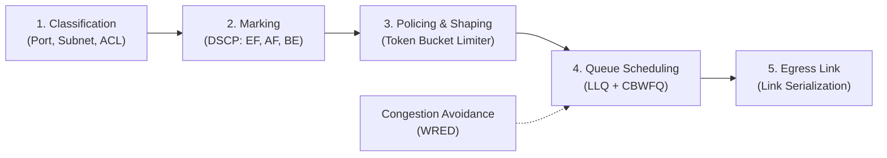

# Quality of Service (QoS) Network Architecture
### Campus Multi-Service Traffic Prioritization Framework for Online Blended Education

---

## 1. Service Characterization & Performance Objectives

University e-learning networks transport simultaneous flows with divergent delay, jitter, and loss tolerance. The architecture classifies campus traffic into four defined tiers:

| Traffic Class | Payload Application | Bandwidth | Max Latency | Max Jitter | Loss Cap | Priority |
| :--- | :--- | :--- | :--- | :--- | :--- | :--- |
| **Voice** | VoIP, Real-Time Audio | 32–64 kbps | < 150 ms | < 30 ms | < 1% | **P1 (EF)** |
| **Live Video** | Lectures, Webinars (Zoom/Teams) | 1.5–5 Mbps | < 220 ms | < 50 ms | < 1.5% | **P2 (AF41)** |
| **Web / LMS** | Canvas, Moodle, HTTP/HTTPS | Elastic / Bursty | < 2000 ms | Tolerant | 0% (TCP) | **P3 (AF21)** |
| **Bulk Downloads** | ISOs, Lab Submissions, FTP | Opportunistic | Insensitive | Insensitive | 0% (TCP) | **P4 (BE)** |

---

## 2. End-to-End Traffic Conditioning & Marking Workflow

Boundary routers inspect incoming packets, assign DSCP/CoS indicators, and police non-conformant rates prior to egress queue placement:

1. **Classification**: Identify packet types via Port, Subnet, or Access Control Lists (ACL).
2. **Marking**: Apply DSCP / CoS tags (`EF`, `AF41`, `AF21`, `BE`).
3. **Policing & Shaping**: Enforce traffic contracts using Token Bucket limiters.
4. **Queue Scheduling**: Schedule via Low Latency Queuing (LLQ) and Class-Based Weighted Fair Queuing (CBWFQ).
5. **Congestion Avoidance**: Weighted Random Early Detection (WRED) applied to queues.
6. **Egress Link**: Serialization onto output interface.

---

## 3. Queue Allocation Matrix

* **Strict Priority: Low Latency Queuing (LLQ)**
  * Assigned exclusively to **Voice (DSCP EF)**.
  * De-queued before all other classes.
  * Governed by a hard policing rate to prevent link starvation of lower tiers during abnormal voice traffic spikes.

* **Class-Based Weighted Fair Queuing (CBWFQ)**
  * Guarantees weighted bandwidth allocations for non-realtime interactive data during link congestion periods:
    * **Video:** 50%
    * **LMS Portals:** 20%
    * **General Web Traffic:** 10%

* **Weighted Random Early Detection (WRED)**
  * Enabled on TCP-heavy queues (LMS and Bulk Downloads).
  * Actively drops packets early based on configurable queue thresholds, initiating TCP back-off algorithms and preventing global TCP synchronization.

* **Best-Effort Elastic Pool (BE)**
  * Bulk downloads and unauthorized file distribution consume dynamic unallocated capacity (10–20%).
  * When real-time demand peaks, background flows are compressed without dropping voice or video frames.

---

## 4. Comparative Performance Under Link Saturation

Performance evaluated over a constrained 100 Mbps bottleneck carrying heavy multi-gigabyte file transfers alongside live interactive lectures:

| Evaluation Metric | Legacy FIFO Network (No QoS) | QoS-Enabled Campus Network | Gain |
| :--- | :--- | :--- | :--- |
| **Voice End-to-End Latency** | 310–380 ms *(Unusable, severe lag)* | 16–22 ms *(Clear real-time interactive)* | **~94% ↓** |
| **Voice Inter-Packet Jitter** | 85–110 ms *(Distorted audio buffer)* | 3–5 ms *(Stable, artifact-free)* | **~95% ↓** |
| **Live Video Loss Rate** | 11.8% *(Frequent frame freezes)* | 0.2% *(Continuous HD lecture stream)* | **98.3% ↓** |
| **LMS Web Response Time** | 4.2 s *(Timeout on quiz submission)* | 0.6 s *(Consistently responsive)* | **85.7% ↓** |
| **Bulk Download Throughput** | Uncontrolled bursts consuming link | Sustained on leftover bandwidth | **Stable** |

---

## 5. Latency Degradation vs. Congestion Profile

| Load / Congestion Level | Standard FIFO Latency | QoS LLQ Model (Voice Delay) |
| :--- | :--- | :--- |
| **20% Load** | < 25 ms | < 25 ms |
| **50% Load** | ~40 ms | < 25 ms |
| **80% Load** | ~80 ms | < 25 ms |
| **100% Saturation** | ~180 ms | < 25 ms |
| **140% Overload** | > 350 ms *(Severe degradation)* | **< 25 ms *(Strictly constrained)*** |

---

## 6. Simulation Implementation Blueprint

Implementation framework for academic network emulation and queuing modeling.

### Academic & Simulation Environment Options
Practical verification can be conducted via:
* **Cisco Packet Tracer / GNS3**: Enterprise CLI configuration and verification.
* **Mininet + OpenFlow**: SDN testbed with Linux `tc` queue disciplines.
* **Discrete-Event Simulation (Python)**: Discrete-event queue modeling using `simpy` or custom event drivers.

### Step-by-Step Implementation

1. **Topology Setup**:
   * Construct a dumbbell topology comprising 4 sender workstations (*Voice client*, *Video streamer*, *Web client*, *Bulk file source*).
   * Route senders through an **Ingress Router**, crossing a throttled **10 Mbps bottleneck link** to an **Egress Router**, and terminating at targeted receivers.

2. **Traffic Generation**:
   * Run continuous multi-client flows using `iperf3` or `D-ITG`:
     * **Voice:** CBR UDP packets (64 kbps, 64-byte payload).
     * **Video:** Dynamic Poisson burst UDP packets (3.5 Mbps, 1200-byte payload).
     * **Bulk:** Concurrent saturating TCP multi-stream downloads.

3. **Policy Configuration**:
   * Define `class-map`s and `policy-map`s.
   * Designate strict priority for Voice (`LLQ`).
   * Assign `CBWFQ` bandwidth percentages for Video and Web traffic.
   * Apply `random-detect` (`WRED`) to the default Best-Effort queue.

4. **Verification Metrics**:
   * Capture egress traces in Wireshark.
   * Generate latency histograms, jitter standard deviations, and throughput distribution across traffic classes.
